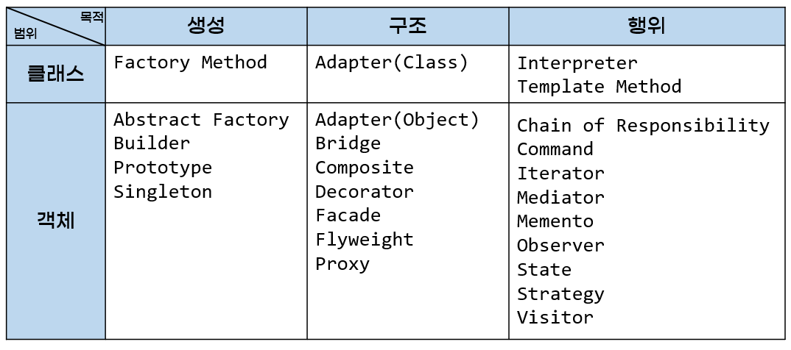

# 디자인 패턴 - 생성/구조/행위 패턴의 개념 및 특징과 적용 예시

## 디자인 패턴

> **소프트웨어 디자인 패턴**(software design pattern)은 [소프트웨어 공학](https://ko.wikipedia.org/wiki/%EC%86%8C%ED%94%84%ED%8A%B8%EC%9B%A8%EC%96%B4_%EA%B3%B5%ED%95%99)의 [소프트웨어 디자인](https://ko.wikipedia.org/wiki/%EC%86%8C%ED%94%84%ED%8A%B8%EC%9B%A8%EC%96%B4_%EB%94%94%EC%9E%90%EC%9D%B8)에서 특정 문맥에서 공통적으로 발생하는 문제에 대해 재사용 가능한 해결책이다. 소스나 기계 코드로 바로 전환될수 있는 완성된 디자인은 아니며, 다른 상황에 맞게 사용될 수 있는 문제들을 해결하는데에 쓰이는 서술이나 템플릿이다. 디자인 패턴은 프로그래머가 어플리케이션이나 시스템을 디자인할 때 공통된 문제들을 해결하는데에 쓰이는 형식화 된 가장 좋은 관행이다. ([위키백과](https://ko.wikipedia.org/wiki/%EC%86%8C%ED%94%84%ED%8A%B8%EC%9B%A8%EC%96%B4_%EB%94%94%EC%9E%90%EC%9D%B8_%ED%8C%A8%ED%84%B4))
>

소프트웨어 세계에서 디자인 패턴이란 용어는, 워딩 그대로 해석해서 디자인 유형, 혹은 설계 양식으로 바꿔 말할 수 있다. 즉 소프트웨어를 만들 때, 이를 설계하는 구조화된 양식들을 통칭하여 디자인 패턴이라고 부른다고 할 수 있으며 조금 더 구체적으로는 소프트웨어를 설계하는 데 있어 자주, 그리고 공통적으로 나타나는 문제들에 대하여 코드를 재사용하기 편리하도록 구조화하여 정리한 것이다.

## GoF 디자인 패턴

GoF는  Gang of Four(4인방)의 약자로, 앞서 설명한 디자인 패턴에 대한 논문 (Design Patterns: Elements of Reusable Object-Oriented Software)을 작성한 4명의 저자들이 제안한 세 가지 카테고리의 23개의 패턴들을 GoF 디자인 패턴이라고 일컫는다. 논문에서 대부분의 예제는 C++로 작성되어 있고, 일부는 Smalltalk로 작성돼있다고 한다.

GoF 디자인 패턴은 두 가지의 기준으로 분류된다.

첫째로, 목적에 따라 분류하면 **생성, 구조, 행동** 3가지로 나눌 수 있다. 각각의 패턴이 어떤 일을 하기 위한 것인지에 관한 것이다. 생성 패턴은 객체의 생성 과정에 관여, 구조 패턴은 객체의 합성에 관여, 행동 패턴은 객체가 상호작용하는 방법이나 관심사를 분리하는 방법에 관여한다.

둘째로 범위에 따라 분류할 수도 있다. 패턴을 주로 **클래스**에 적용하는지, **객체**에 적용하는 지 구분하는 것이다. 클래스 패턴은 클래스와 서브클래스 간의 관련성을 다룬다. 주로 상속을 통해 관련되며, 컴파일 타임에 정적으로 결정된다. 객체 패턴은 객체 간의 관련성을 다루고, 런타임에 변경될 수 있는 동적인 성격을 가진다.



## 생성 패턴

**추상 팩토리 패턴**

```jsx
// ...예시 코드와 비교 코드...
// 장단점 및 특징
```

**빌더**

**팩토리 메서드**

**프로토타입(원형)**

**싱글턴(Singleton) 패턴**

## 구조 패턴

**어댑터(Adapter)**

**브릿지(Bridge)**

**컴포지트(Composite)**

**데코레이터(Decorator)**

**파사드(Façade)**

**프록시(Proxy)**

**플라이웨이트(Flyweight)**

## 행위 패턴

**책임 연쇄(Chain of Responsibility)**

**커맨드(Command)**

**인터프리터(Interpreter)**

**반복자(Iterator)**

**중재자(Mediator)**

**메멘토(Memento)**

**옵저버(Observer)**

**상태(State)**

**전략(Strategy)**

**템플릿 메소드(Template Method)**

**방문자(Visitor)**

# References

- [https://4z7l.github.io/2020/12/25/design_pattern_GoF.html](https://4z7l.github.io/2020/12/25/design_pattern_GoF.html)
